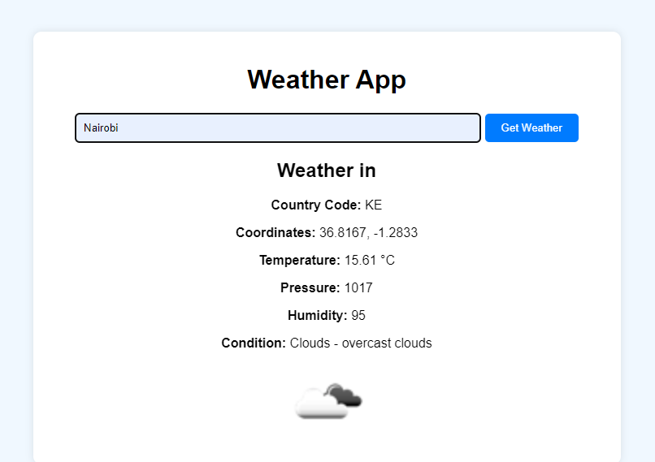

# DJANGO WEATHER APP
An app that allows users to check the wheather using city names
***

***

***
## HOW TO USE
1. Clone the repo
2. Install django and the requirements
3. Generate an API KEY from [Openweather](https://home.openweathermap.org/api_keys)
4. Run your app